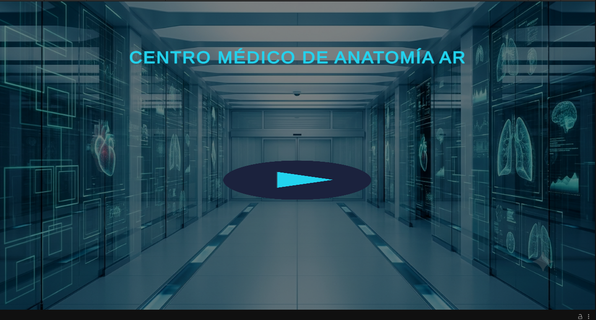
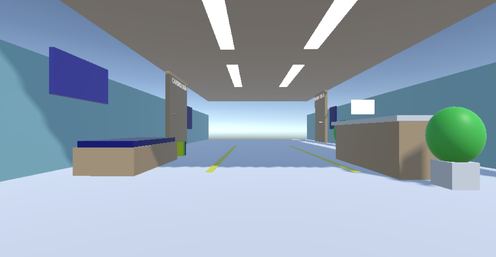
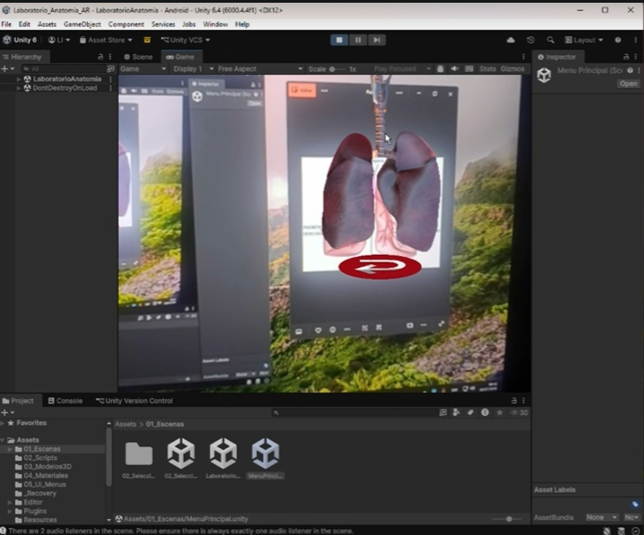
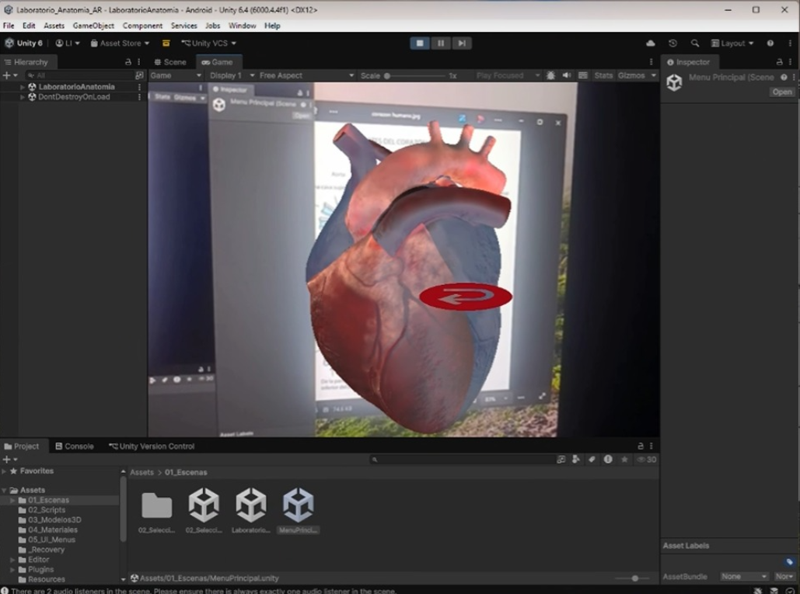

# 🫁 Tutor de Anatomía en RA

### Universidad Autónoma del Perú — Ingeniería de Sistemas — Semestre 2026-1
*Curso: PSISP08075 — Realidad Virtual y Aumentada*

---

## 📋 Descripción del Problema

En la enseñanza tradicional de la medicina y la biología, el estudio de los sistemas internos (como el corazón y los pulmones) se realiza de forma bidimensional mediante libros de texto y pizarras. La falta de acceso a laboratorios físicos o cadáveres en etapas tempranas de estudio dificulta la comprensión tridimensional de los órganos, sus movimientos y su escala real.

**Tutor de Anatomía en RA** resuelve este problema creando una experiencia inmersiva e interactiva multiplataforma (PC / Dispositivo Móvil) donde los estudiantes pueden:
- 🧬 **Visualizar** modelos 3D hiperrealistas de órganos sobre marcadores físicos.
- 🫀 **Interactuar** con animaciones procedurales en tiempo real (ciclos de latidos y respiración).
- 🕹️ **Navegar** e interactuar mediante controles híbridos (teclado/mouse en PC y táctil en móviles) dentro de un entorno de clínica virtual.
- 📚 **Aprender** anatomía humana de manera práctica, segura y motivadora.

---

## 🖼️ Capturas del Proyecto

### Menú Principal


### Selección de Salas


### Laboratorio de Anatomía



---

## 🛠️ Tecnologías Utilizadas

| Tecnología | Versión | Uso |
|---|---|---|
| **Unity 6** | 6000.4.4f1 | Motor de desarrollo principal |
| **C#** | — | Lenguaje de programación |
| **Vuforia Engine** | 11.4.x | SDK para el tracking e identificación de marcadores AR |
| **GitHub** | — | Control de versiones |

### Assets utilizados
- 🫁 **Human Internal Organs Pack** — Modelos 3D de sistemas anatómicos
- 🏥 **Hospital & Clinic Environment Pack** — Assets del entorno de la clínica virtual
- ⚙️ **DefaultVolumeProfile.asset** — Configuración gráfica de postprocesado

---

## 💻 Requisitos de Instalación

### Requisitos mínimos del sistema (Dispositivo Móvil)
- **OS:** Android 7.0+ (API 24+) con soporte para la cámara
- **Hardware:** Cámara trasera funcional para detección de marcadores de Vuforia
- **Almacenamiento:** 500 MB libres

### Requisitos mínimos del sistema (PC / Ejecutable)
- **OS:** Windows 10 / 11 (64-bit)
- **RAM:** 8 GB mínimo
- **GPU:** Tarjeta gráfica con soporte DirectX 11 / DirectX 12
- **Hardware:** WebCam funcional conectada para la detección de marcadores en entorno de escritorio

### Para desarrolladores (editar el proyecto)
- **Unity Hub** instalado
- **Unity 6** (versión exacta: 6000.4.4f1)
- **Visual Studio 2022** o VS Code
- **Git** instalado

---

## 🚀 Cómo Ejecutar

### Opción A — Ejecutar el juego compilado (PC / Windows)

1. Descarga la carpeta Build/ o el ejecutable zip para PC desde el repositorio

2. Descomprime el archivo y ejecuta 'TutorAnatomiaRA.exe'

3. Asegúrate de tener una WebCam conectada para el reconocimiento de los marcadores

4. El juego iniciará automáticamente en el Menú Principal


### Opción B — Ejecutar el juego compilado (Celular / Android)
1. Descarga el archivo APK generado desde el repositorio o la carpeta Build/

2. Instala el APK en un dispositivo Android compatible

3. Otorga los permisos de cámara y la app iniciará en el Menú Principal


### Opción C — Abrir en Unity Editor (Desarrollo Multiplataforma)
1. Clona el repositorio:
git clone https://github.com/lcarbonelli-oss/AR-VR-g04-tutor-anatomia-ra.git

2. Abre Unity Hub → Add → selecciona la carpeta clonada

3. Asegúrate de tener Unity 6 (6000.4.4f1) instalado

4. Abre la escena: Assets/01_Escenas/MenuPrincipal.unity

5. Presiona ▶ Play (puedes usar tu WebCam en tiempo real para probar el tracking de Vuforia directamente en el editor)

### 🎮 Controles del juego (Híbridos PC / Móvil)
| Control PC | Control Móvil | Acción |
|---|---|---|
| `W A S D` / Flechas | `Joystick UI` | Desplazamiento por el entorno clínico |
| `Click Izquierdo + Drag` | `Touch Drag` | Arrastre, rotación y manipulación de órganos en AR |
| `Click Izquierdo` | `Touch Tap` | Interacción especializada con submallas 3D |
| `Automático` | `Lerp Return` | Retorno suave de los componentes a su posición original |

---

## 📁 Estructura del Proyecto
```
Assets/
├── 01_Escenas/
│   ├── MenuPrincipal.unity
│   ├── 02_SeleccionSalas.unity
│   └── LaboratorioAnatomia.unity
├── 02_Scripts/
│   ├── AnimacionOrganos.cs
│   ├── CaminarClinica.cs
│   ├── ClinicaDatos.cs
│   ├── ControladorEscenas.cs
│   ├── ControladorInfoAR.cs
│   ├── ControladorJoystick.cs
│   ├── ControladorMarcadoresAR.cs
│   ├── ControladorMenu.cs
│   ├── InteraccionEspecializada.cs
│   ├── InteraccionTactilAR.cs
│   ├── JoyTouchController.cs
│   ├── LineaIndicadora.cs
│   └── SimpleJoystick.cs
├── Audio/
├── Materials/
├── Prefabs/
└── DefaultVolumeProfile.asset
```
---

## ✅ Estado del Proyecto

> 🚧 **Versión actual: 100% completado**

| Fase | Descripción | Estado |
|---|---|---|
| **Fase 1** | Investigación de mercado, definición del MVP y arquitectura técnica inicial | ✅ Completo |
| **Fase 2** | Menú principal, selección de salas e integración multiplataforma de Vuforia Engine | ✅ Completo |
| **Fase 3** | Importación de modelos 3D de órganos, mapeo de inputs (PC/Móvil) e interacciones (Lerp) | ✅ Completo |
| **Fase 4** | Optimización de FPS en Unity 6, pruebas de usabilidad SUS y despliegue del ejecutable y APK final | ✅ Completo |

---

## 👥 Equipo de Desarrollo

| Nombre | Rol |
|---|---|
| **Leonardo Alexander Carbonell Ishuiza** | 💻 Líder de Proyecto / Programador Core AR (Vuforia Multiplataforma) |
| **Piero Isaac Araujo Huamani** | 🎨 Diseñador de Escenarios 3D y Entorno |
| **Juan Carlos Villalobos Sandoval** | 🕹️ Diseñador de UI / UX y Canvas HUD (Soporte PC/Móvil) |
| **Isaac Josue Peralta Sandoval** | 🧪 Tester, Control de Calidad (QA) y Documentación |

---

## 🎬 Video Demo

> 🎥 **Video Demo** — [AQUÍ EL ENLACE A TU VIDEO DE RESPALDO DE YOUTUBE O DRIVE]

---

## 📌 Notas Técnicas

- **NO volver a añadir** el archivo pesado `.tgz` de Vuforia de forma local para evitar bloqueos con el límite de 100MB de GitHub. El Package Manager lo resuelve de forma nativa.
- **Manejar la escena principal** desde la ruta corregida `Assets/01_Escenas/` para evitar conflictos de sobreescritura.
- El build system está configurado para permitir el cambio de plataforma ágil entre **Standalone (PC)** y **Android** manteniendo las dependencias del tracking intactas.

---

<div align="center">
  <strong>🫁 Tutor de Anatomía en RA</strong><br>
  Desarrollado con Unity 6 · C# · Vuforia Engine Multiplataforma · GitHub<br><br>
  <em>"Educación Médica de Calidad"</em>
</div>
